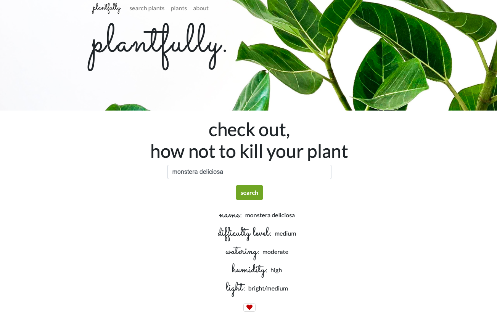

# plantfully 🌱
An app which helps you to take care of your plants.

[Website demo](https://agatapst.github.io/plantfully/)

## Table of Contents
- General info
- Setup
- Technologies
- Status
- Additional info

### General info
Project is a simple app for people interested in indoor plants (or for whom just do not want to kill them). User can use the searchbar to get some details about indoor plants cultivation (such as watering or humidity needs). Then, it is possible to add favourite plants to local storage and recall flower demands when needed.

## Setup
Install dependencies

    $ npm install

Compile SASS & JS

    $ gulp watch

### Technologies
- CSS3 / SASS
- HTML5
- Bootstrap 4
- JavaScript / jQuery
- Gulp 
- Local storage
- [Scroll Reveal](https://scrollrevealjs.org)

### Status
The basic version of the project is done. In the future, there are plans to add Wikipedia API with plant images.

### Additional info
The idea to create Plantfully was to help myself in my own cultivation of indoor plants. The whole concept as well as project layout and structure were designed by me.

Images was downloaded from [Unsplash](https://unsplashed.com).

